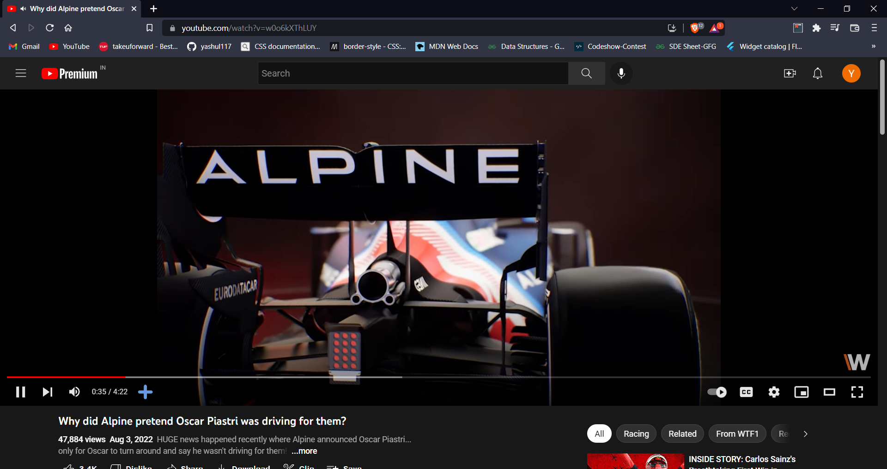
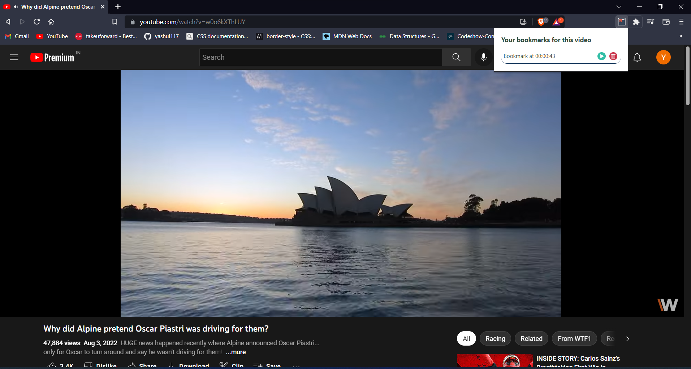
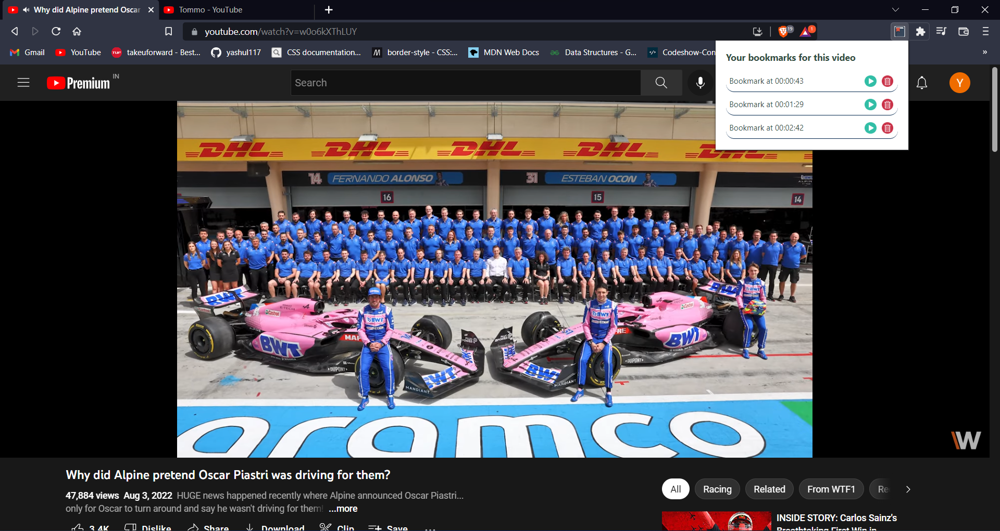
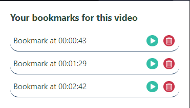

# Youtube-bookmark-extension
A browser extension to bookmark youtube video timestamps.

## Installation and Setup
```
Step 1: Download the extension using git clone https://github.com/yashul117/Youtube-bookmark-extension
Step 2: Go to extensions page in your browser and turn on developer mode.
Step 3: Click on 'Load Unpacked' tab.
Step 4: Select the downloaded folder.

```
## Working
Play any youtube video and notice the '+' icon on the video player options.
Click on the '+' icon to add a bookmark.
You can view your bookmarks by clicking on the extension at the top right corner of your screen.
In the bookmarks list, click on play to play the video from that timestamp and click on delete to delete a bookmark. 

## Screenshots
<center></center>
<center></center>
<center></center>
<center></center>
